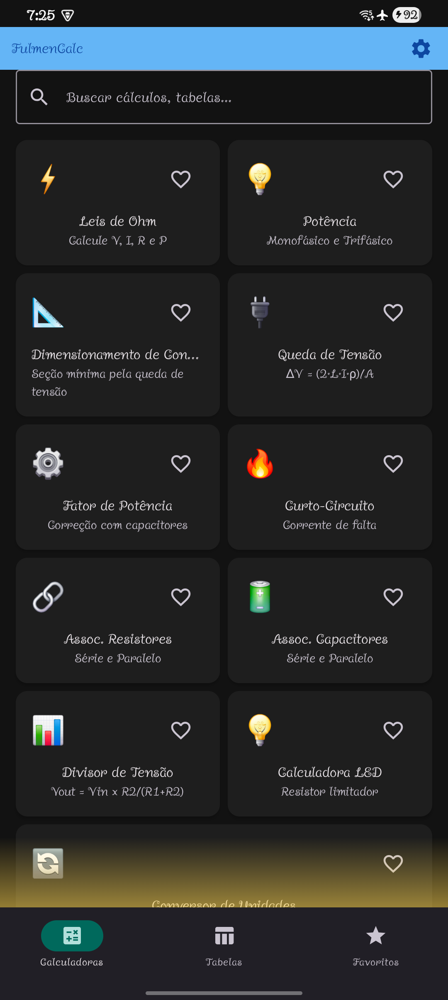
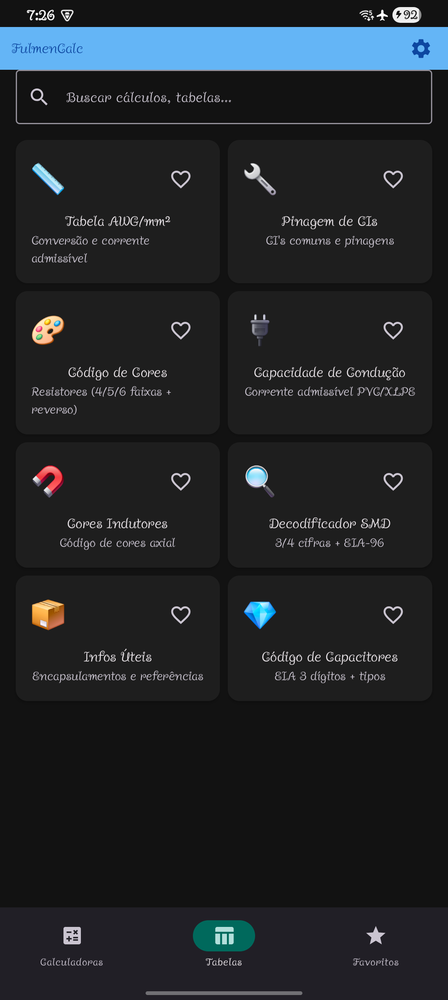
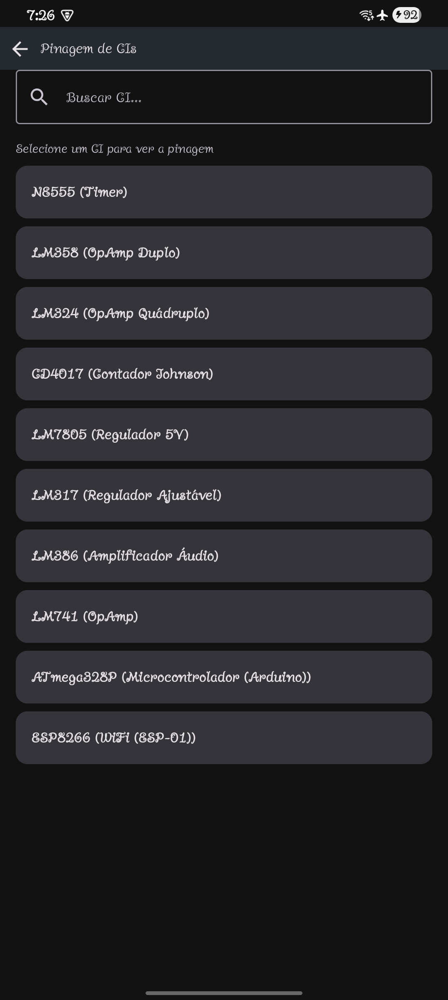
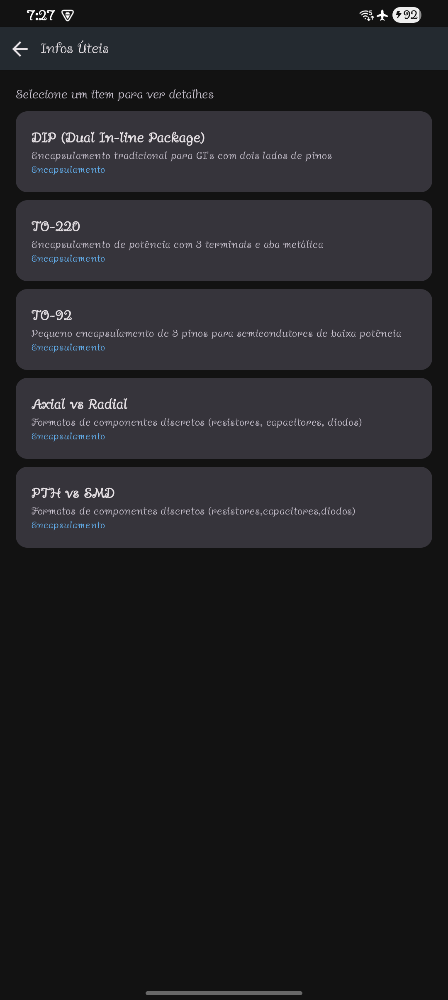
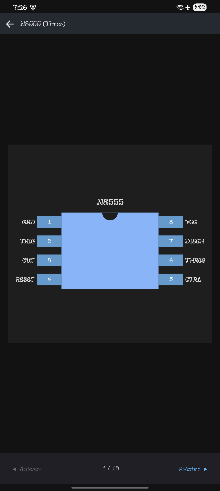
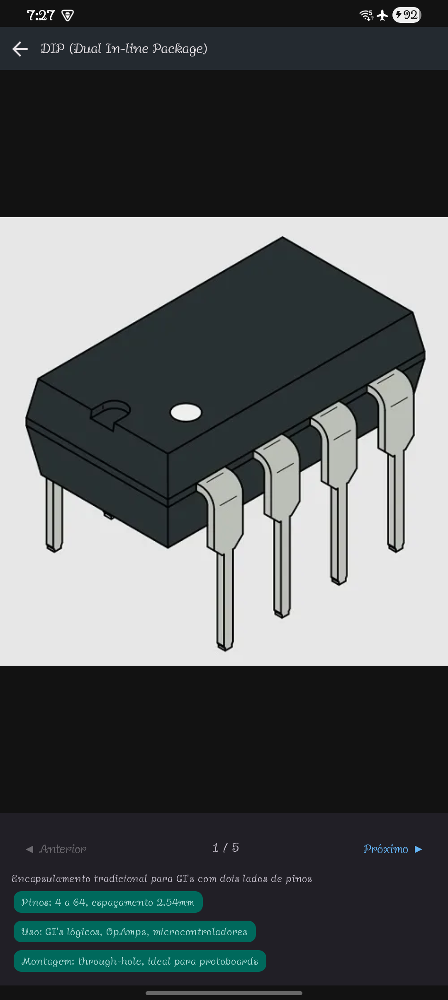

# ⚡ FulmenCalc

Calculadora elétrica para **eletricistas** e **engenheiros de automação**, com tabelas de referência e pinagem interativa de CIs — tudo em um app Android.

-3DDC84?logo=android&logoColor=white)


---

## 📱 Screenshots

| Calculadoras | Tabelas | Pinagem de CIs | Infos Úteis |
|:---:|:---:|:---:|:---:|
|  |  |  |  |

| Diagrama interativo (NE555) | Detalhe de Infos Úteis |
|:---:|:---:|
|  |  |

---

## 🧮 Calculadoras

- **Lei de Ohm** — V, I, R e P
- **Potência** — monofásico e trifásico
- **Queda de Tensão** — ΔV = (2·L·I·ρ)/A
- **Fator de Potência** — correção com capacitores
- **Curto-Circuito** — corrente de falta
- **Dimensionamento de Condutores (NBR 5410)** — seção mínima pela queda de tensão
- **Associação de Resistores e Capacitores** — série e paralelo
- **Divisor de Tensão** — Vout = Vin × R2/(R1+R2)
- **Calculadora LED** — resistor limitador
- **Conversor de Unidades**

## 📚 Tabelas

- **Tabela AWG/mm²** — conversão e corrente admissível
- **Capacidade de Condução** — corrente admissível PVC/XLPE
- **Código de Cores** — resistores (4/5/6 faixas + reverso), capacitores e indutores
- **Decodificador SMD** — 3/4 cifras, EIA-96, A11
- **Pinagem de CIs** — diagrama interativo (toque nos pinos para ver a função)
- **Infos Úteis** — encapsulamentos e referências

## 🔄 Dados atualizáveis

Pinagens e Infos Úteis são **baixadas automaticamente da internet** ao abrir o app:

- O app verifica por atualizações ao iniciar (quando há conexão);
- Se houver novidades, baixa e aplica automaticamente;
- Os dados ficam **salvos no celular** — funcionam normalmente **offline** depois da primeira sincronização.

## 📥 Instalar

Baixe o APK mais recente na página de [Releases](https://github.com/luxasfill/FulmenCalc/releases) e instale no celular.

> Ao instalar sobre uma versão anterior, os dados já baixados são mantidos.

## 📋 Requisitos

- **Android 8.0 (API 26)** ou superior
- Conexão com a internet na primeira sincronização (opcional depois)

## 🗂️ Estrutura do repositório

```
├── README.md          ← esta página
├── screenshots/       ← capturas de tela do app
└── remote/            ← dados distribuídos ao app
    ├── data.json          → CIs e Infos Úteis
    ├── versions.json      → versões dos dados (cache offline)
    └── images/            → imagens das Infos Úteis
```
